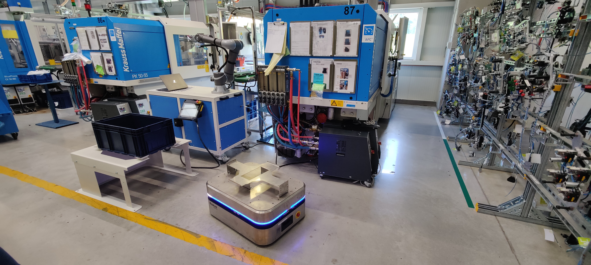
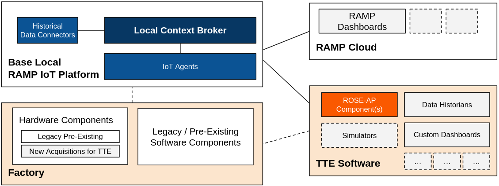
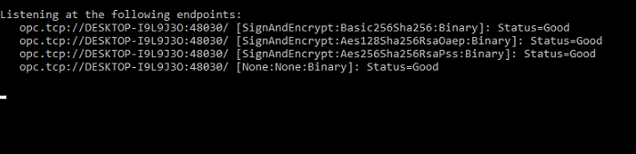
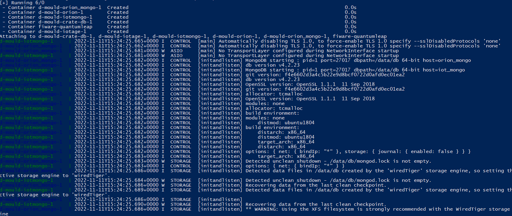
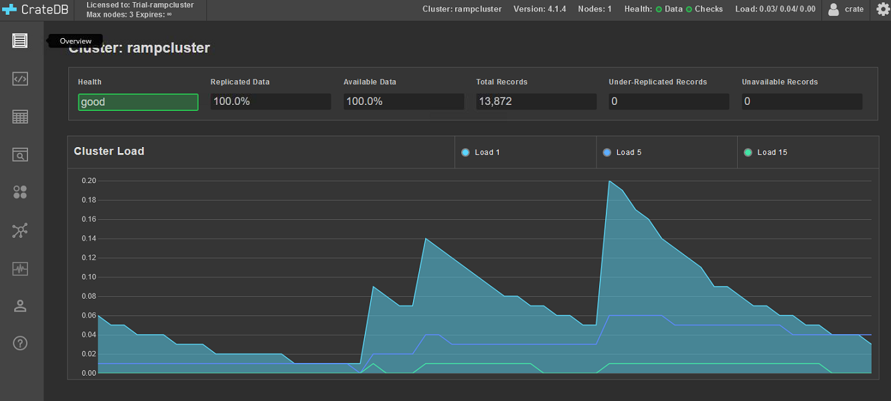
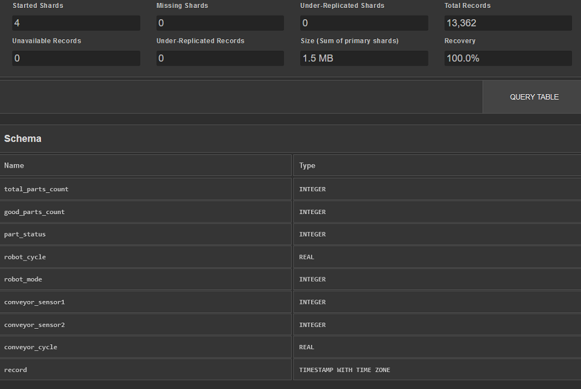
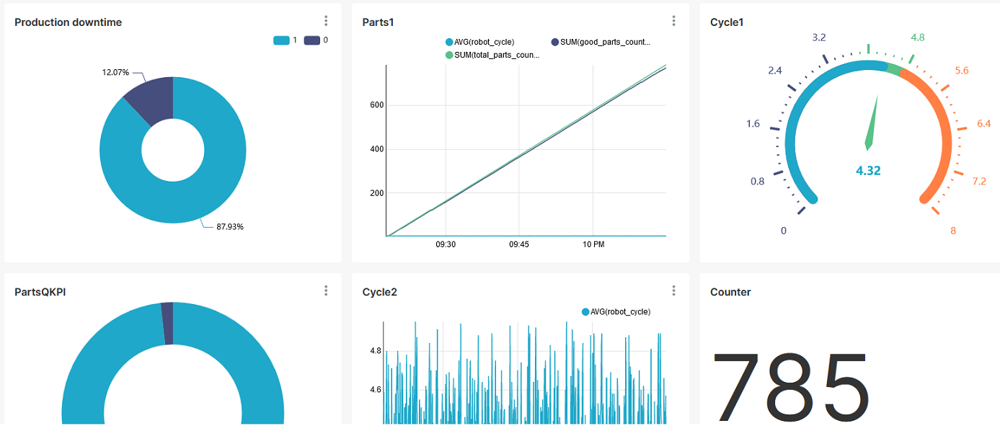
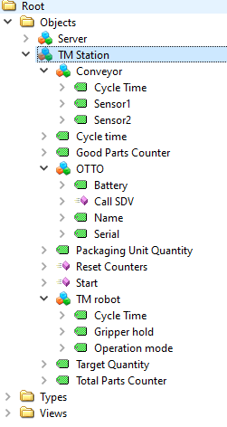

# D-Mould, ROSE-AP

## Contents

- [Background](#background)
- [Installation](#Installation)
- [Usage](#usage)
- [License](#license)


## Background

D-Mould is a robotics-based solution that contributes to the continuous production of moulding machines with reduced downtime and a more reliable process resulting in decreased human risk factors and increased production output.

## Architecture

Experimental setup consists of **Pre-Existing hardware:**
* Injection moulding machine (IMM), 
* Linear robot, 
* Conveyor belt 

**and new hardware:**
* Cobot 1, 
* Cobot 2,
* Autonomous mobile robot (AMR),
* VLM. 878


<div>
  <p align="center">
    
  </p>
  <p align="center">New hardware</p>
</div>

Both Cobots are equipped with **computer vision system for parts detection**, AMR is equipped with laser scanners and 3D cameras.

We‘re exporting NGSI entities to **Orion Context Broker** running **OPC/UA IoT Agent**. Instance of **SQL (PostgreSQL) server** is used to store historical data. Context Broker and NGSI system entities are running on **local network**. Database with historical data is accessable on public address *dmouldramp.ddns.net* through port **5432**. The database is accessible on demand. 

The image below shows how **ROSE-AP** is integrated in the Factory and connected to **RAMP**.

<div>
  <p align="center">
    
  </p>
  <p align="center">Architecture overview</p>
</div>


## Installation

Follow our  [video step-by-step tutorial](https://youtu.be/zo8Bf4FP3qM) or use installation documentation below.

Supported OS for this project is Windows 10 and Linux, however our main test environment was Windows 10 so we will include only instructions for this specific OS and we recommend using it for your testing purposes.

To run a project clone/download a git repository and follow instructions below.


### C# application

Open folder **x64** and start **D-MouldOpc.exe**. To run application you should have [.NET 5.0 installed](https://dotnet.microsoft.com/en-us/download/dotnet/5.0) on computer.

Let the console application run in the background. The output will be similar as one on the picture below:

<div>
  <p align="center">
    
  </p>
  <p align="center">OPC console output</p>
</div>


### Docker 

To install Docker follow the [official instructions](https://docs.docker.com/desktop/install/windows-install/) and enable **WSL 2** during the installation, more [WSL information](https://docs.docker.com/desktop/windows/wsl/).

*docker-compose.yml* file shows all the required information regarding ports and network configuration, as well as the environment variables for the containers that require them.

1. After installing, start the Docker Desktop program.

2. Run administrator version of PowerShell in folder **d-mould** and run these commands:

    2.1.  
    ```yaml
    wsl -d docker-desktop
    ```
    2.2.

    ```yaml
    sysctl -w vm.max_map_count=262144
    ```
3. Run a second administrator version of PowerShell in the same folder **d-mould** and run these commands:

    3.1
    ```yaml
    docker compose up
    ```
    You should see a similar output as on image below.
<div>
  <p align="center">
    
  </p>
  <p align="center">PowerShell Docker output</p>
</div>

Let Docker run in the shell and move to the next step.

### CrateDB

To test if everything works as it should open web browser and open the following URL:
[172.28.16.1:4200](http://172.28.16.1:4200), CrateDB dasboard should open.

<div>
  <p align="center">
    
  </p>
  <p align="center">CrateDB dashboard</p>
</div>

## Usage

Tables in dashboard are showing data from machines, further processing/querrying can be done following instructions on CrateDB website, e.g. [Selecting data](https://crate.io/docs/crate/reference/en/5.1/general/dql/selects.html), etc,.
<div>
  <p align="center">
    
  </p>
  <p align="center">Data</p>
</div>

Data is also visualised in our RAMP dashboard
<div>
  <p align="center">
    
  </p>
  <p align="center">RAMP dasboard</p>
</div>

## Appendix

### KPI calculation example

<div>
  <p align="center">
    
  </p>
  <p align="center">KPI example</p>
</div>

 [Click to sample csv data example](https://github.com/proaimslovenia/D-Mould/blob/main/data.csv)


### Entity descriptions

The OPC-UA nodes are translated to FIWARE Orion Context Broker entities via mapping configuration file. The mapping is done in the following way as shown in the json file on the link below.

 [Click to view json example](https://github.com/proaimslovenia/D-Mould/blob/main/entityDescriptions.json)

 This is also presenting the entities available in the context broker.

 #### Entity description

    • Cycle time – numeric variable, presenting the complete cycle time of a workstation
    • Good parts counter – numeric variable, presenting the counter of good partis since last counter reset
    • Total parts counter – numeric variable, presenting the total count of parts since last reset of the counters. It is actually presenting the sum of good and bad parts
    • Target quantity – numeric variable, presenting the goal count of good parts to complete the work order
    • Packaging unit quantity – numeric variable, presenting the amount of parts, which fits in transportation box. This variable is used for automatic call of the OTTO SDV.
    • Sensor 1 – Boolean variable, presenting the status of the sensor at the drop zone of the conveyor. This data can be used to determine bottlenecks and unusual behavior
    • Sensor 2 – Boolean variable, presenting the status of the sensor at the pick zone of the conveyor. This data can be used to determine bottlenecks and unusual behavior
    • Operation mode – numeric variable, mode of the robot. It can be used to detect errors and interference of the operators

<div>
  <p align="center">
    
  </p>
  <p align="center">OPC-UA discovery example</p>
</div>


## License

The project is licensed under the [Apache-2](https://opensource.org/licenses/Apache-2.0) license.
